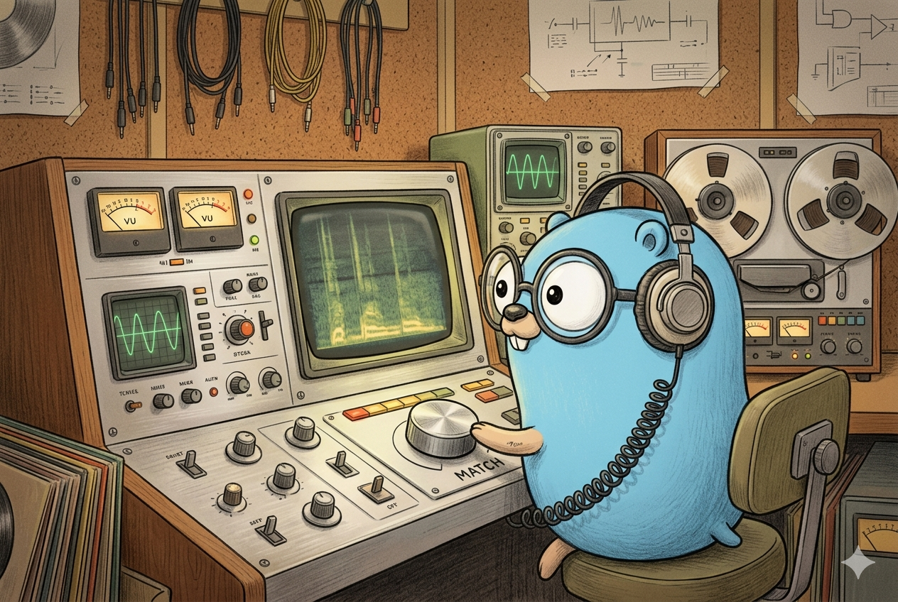
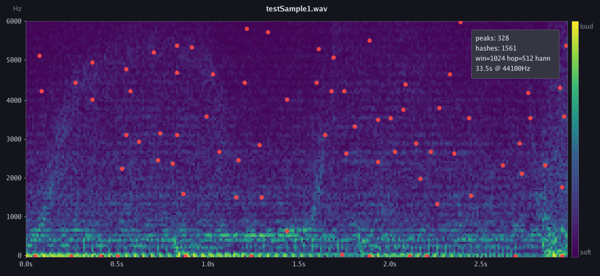

<p align="center">
  
</p>

<h1 align="center">Presto</h1>

<p align="center">
  <strong>Audio fingerprinting and recognition in Go</strong>
</p>

<p align="center">
  <a href="https://pkg.go.dev/github.com/nddq/presto"></a>
  <a href="https://goreportcard.com/report/github.com/nddq/presto"></a>
  <a href="LICENSE"></a>
</p>

<p align="center">
  <a href="#quick-start">Quick Start</a> &bull;
  <a href="#spectral-analysis">Analyze</a> &bull;
  <a href="#how-it-works">How It Works</a> &bull;
  <a href="#http-api">HTTP API</a> &bull;
  <a href="#container-and-kubernetes">Deploy</a> &bull;
  <a href="#performance">Performance</a> &bull;
  <a href="#testing">Testing</a>
</p>

---

Presto identifies a song from a short audio clip by comparing compact
fingerprints against a persistent library. Two fingerprinting algorithms
are available — choose at index time, auto-detected at match time:

| Property | Constellation (default) | Sub-band |
| --- | --- | --- |
| Approach | Peak-pair hashing (Wang 2003) | Mel-band energy bits (Haitsma-Kalker 2002) |
| Match speed (500 songs) | **2.6 ms** | ~700 ms |
| Score range | 0–0.15 (use margin for confidence) | 0–1 (calibrated) |
| Real-music noise robustness | Strong | Moderate |
| Synthetic noise robustness | Fragile on pure tones | Strong |
| Best for | Production, real music | Clean exact-match, research |

Both algorithms share the same STFT spectrogram pipeline and store
format. The project has **zero external Go dependencies** — FFT, WAV
I/O, window functions, and the inverted-index matcher are all
implemented from scratch using only the standard library.

## Quick start

```bash
go build ./cmd/presto

# Index a directory of WAV files (default: constellation)
./presto index ./songs/ library.prfp 1024 512 hann

# Index with sub-band algorithm instead
./presto index ./songs/ library.prfp 1024 512 hann --algo subband

# Match a clip (auto-selects algorithm from the library header)
./presto match library.prfp sample.wav

# Run as an HTTP service
PRESTO_STORE_PATH=./library.prfp ./presto serve
```

Input files must be PCM WAV (8, 16, 24, or 32-bit).
Window function options: `hann`, `hamming`, `bartlett`, or omit for none.

## Spectral analysis

`presto analyze` generates annotated spectrogram PNGs with viridis
colormap, frequency/time axes, peak overlay, and fingerprint stats.

```bash
# Analyze a WAV file — produces spectrogram.png and spectrogram_peaks.png
./presto analyze song.wav output/

# Generate a synthetic chirp spectrogram (no WAV needed)
./presto analyze --chirp output/
```

<p align="center">
  
</p>

## How it works

Both algorithms share the first stage: audio is decoded, normalized,
and processed through a sliding STFT to produce a magnitude
spectrogram (time x frequency). After that they diverge.

**Constellation** finds local maxima (peaks) in the 2D spectrogram,
pairs nearby peaks into `(f1, f2, dt)` hashes, and builds a direct
hash inverted index. Matching is a single hash-table lookup per sample
hash followed by vote accumulation on `(songID, timeOffset)`.

**Sub-band** groups FFT bins into 40 mel-frequency bands and emits one
bit per adjacent-band energy comparison (39 bits per frame). The store
uses locality-sensitive hashing (8 random 12-bit projections per frame)
for candidate filtering, then verifies top candidates with a
sliding-window byte-level comparison using unsafe uint64 XOR.

For the full walkthrough with real spectrogram visualizations, peak
overlays, hash examples, and a worked voting example, see
[**docs/algorithm.md**](docs/algorithm.md).

## HTTP API

`presto serve` exposes a read-only HTTP API. The server loads one
library at startup and auto-selects the fingerprinting algorithm from
the library header.

| Method & path | Description |
| --- | --- |
| `POST /v1/match` | Upload raw WAV bytes, receive top-5 matches as JSON |
| `GET /v1/stats` | Library metadata (song count, algorithm, parameters) |
| `GET /healthz` | Liveness probe (always 200) |
| `GET /readyz` | Readiness probe (200 once store is loaded) |
| `GET /metrics` | Prometheus text-format metrics |

<details>
<summary><strong>Configuration</strong></summary>

| Variable | Default |
| --- | --- |
| `PRESTO_LISTEN_ADDR` | `:8080` |
| `PRESTO_STORE_PATH` | `/var/lib/presto/library.prfp` |
| `PRESTO_MAX_UPLOAD_BYTES` | `10485760` (10 MiB) |

</details>

<details>
<summary><strong>Example</strong></summary>

```bash
curl -X POST --data-binary @sample.wav \
  -H "Content-Type: audio/wav" \
  http://localhost:8080/v1/match
```

```json
{
  "matches": [
    {"name": "song_a.wav", "score": 0.1244, "offset": 23832}
  ],
  "margin": 138.7,
  "elapsed_ms": 13
}
```

The `margin` field is the ratio `top1.score / top2.score` — a value
well above 1 signals a confident, unambiguous match.

</details>

## Container and Kubernetes

```bash
docker build -t presto:latest .
docker run --rm -p 8080:8080 \
  -v $PWD/library.prfp:/var/lib/presto/library.prfp:ro \
  presto:latest
```

Ready-to-apply Kubernetes manifests in [`deploy/k8s/`](deploy/k8s/)
include a locked-down Deployment (non-root, read-only rootfs, seccomp,
probes), Service, PVC, ConfigMap, and optional ServiceMonitor.
See [`deploy/k8s/README.md`](deploy/k8s/README.md) for step-by-step
instructions.

## Performance

Matching a clip against a synthetic library (constellation algorithm):

| Library size | Match time |
| --- | --- |
| 50 songs x 30 s | 0.41 ms |
| 100 songs x 30 s | 0.74 ms |
| 500 songs x 30 s | 2.64 ms |

Real music (7 songs, 33 s clip): **13 ms** match with a **138x margin**
over the runner-up.

## Project layout

<details>
<summary><strong>Directory structure</strong></summary>

```text
cmd/presto/                  CLI + HTTP server
internal/
  audio/                     WAV reader & writer (PCM 8/16/24/32-bit)
  dsp/                       FFT, windows, spectrogram, peaks, mel banding
  fingerprint/               FP type, Strategy interface, registry
    constellation/           Constellation strategy (peak-pair hashing)
    subband/                 Sub-band strategy (mel-band energy bits)
  store/                     Persistent mmap'd library, hash + LSH indexing
  metrics/                   Stdlib-only Prometheus metrics
deploy/k8s/                  Kubernetes manifests
docs/                        Algorithm walkthrough
Dockerfile                   Multi-stage distroless build
```

</details>

## Testing

```bash
go test ./...                             # all tests (short mode)
go test ./internal/fingerprint -v         # fingerprinting integration tests
go test ./internal/store -v               # storage and matching tests
go test ./internal/audio -fuzz=FuzzDecodeWAV -fuzztime=30s  # fuzz the WAV decoder
go test ./... -bench=. -benchmem          # benchmarks
```

## Algorithm references

- **Constellation fingerprinting** — Avery Wang, *An Industrial-Strength
  Audio Search Algorithm*, ISMIR 2003.
  [PDF](https://www.ee.columbia.edu/~dpwe/papers/Wang03-shazam.pdf)

- **Sub-band energy fingerprinting** — Jaap Haitsma & Ton Kalker, *A
  Highly Robust Audio Fingerprinting System*, ISMIR 2002.
  [PDF](https://ismir2002.ismir.net/proceedings/02-FP04-2.pdf)

- **Locality-sensitive hashing** — Piotr Indyk & Rajeev Motwani,
  *Approximate Nearest Neighbors*, STOC 1998.
  [PDF](https://www.cs.princeton.edu/courses/archive/spring13/cos598C/Gionis.pdf)

## License

MIT. See [LICENSE](LICENSE).
