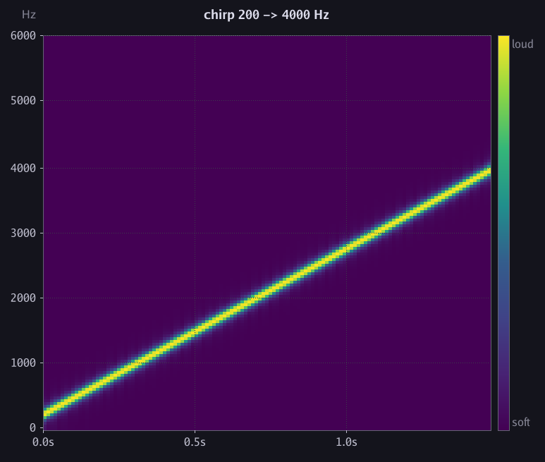
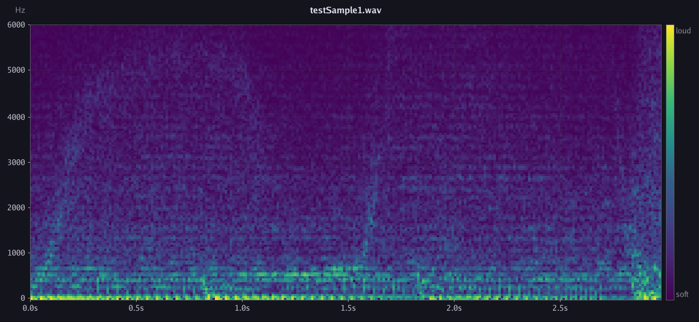

# How Presto identifies audio

This document walks through Presto's audio fingerprinting pipeline from
raw samples to a ranked match result. It covers both algorithms —
**constellation** (the default) and **sub-band** — and explains how the
strategy interface lets them coexist in the same binary.

For the 30-second version, skip to the [summary](#summary).

---

## Contents

1. [The problem](#1-the-problem)
2. [Shared foundation: the spectrogram](#2-shared-foundation-the-spectrogram)
3. [Algorithm A: constellation peak-pair hashing](#3-algorithm-a-constellation-peak-pair-hashing)
4. [Algorithm B: sub-band mel-band energy comparison](#4-algorithm-b-sub-band-mel-band-energy-comparison)
5. [Storage and the inverted index](#5-storage-and-the-inverted-index)
6. [Matching: the voting loop](#6-matching-the-voting-loop)
7. [Reading the scores](#7-reading-the-scores)
8. [Choosing between the algorithms](#8-choosing-between-the-algorithms)
9. [The strategy interface](#9-the-strategy-interface)
10. [Parameter reference](#10-parameter-reference)
11. [Limitations](#11-limitations)
12. [References](#12-references)
13. [Summary](#summary)

---

## 1. The problem

Given a short (1–30 second) audio clip, identify which song in a
library it came from and at what time offset. Hard because of noise,
volume changes, and framing offsets. Tractable because audio has stable
spectral structure that both algorithms exploit differently.

---

## 2. Shared foundation: the spectrogram

Both algorithms start with the same three steps. Everything that
follows operates on the 2D spectrogram they produce.

**Code:** `internal/dsp/spectrogram.go`, `internal/dsp/fft.go`,
`internal/dsp/window.go`

### What a spectrogram is

> A picture with **time** on the horizontal axis, **frequency** on the
> vertical axis, and **brightness** for how loud that frequency is at
> that moment.

Here is a chirp (frequency sweep from 200 Hz to 4 kHz) rendered by
Presto's own pipeline. The diagonal line is exactly what you'd expect
— frequency rises over time:



And here is 2 seconds of real music (an electronic pop track). Most of
the loud content is in the bass and lower mid-range (the bright band at
the bottom). Structured harmonic activity extends up to ~4 kHz; above
that is near-silence:



### How it gets built

1. **Framing** — Slice the signal into 1024-sample windows, advancing
   512 samples each time (50% overlap). A 5-second clip at 44.1 kHz
   produces about 428 frames.

2. **Windowing** — Multiply each frame by a taper (Hann by default) so
   the FFT doesn't see an abrupt edge and mistake it for high-frequency
   content.

3. **FFT** — Decompose each windowed frame into 513 frequency bins
   (each ~43 Hz wide). The magnitudes of those bins are the spectrogram
   row for that frame.

After this, each algorithm takes the spectrogram in a different
direction.

| Term | Meaning |
| --- | --- |
| `winSize = 1024` | Samples per FFT window (~23 ms) |
| `hopSize = 512` | Advance between frames (50% overlap) |
| `frame` | One time slice (~430 per 5 s clip) |
| `bin` | One frequency band (513 total, each ~43 Hz) |

---

## 3. Algorithm A: constellation peak-pair hashing

**Code:** `internal/fingerprint/constellation/constellation.go`,
`internal/dsp/peaks.go`

### Constellation step 1: find peaks

A peak is a spectrogram cell whose magnitude is **strictly greater**
than every other cell in a ±5-frame × ±12-bin neighbourhood. This
keeps only the loudest, most stable spots — the "hilltops" in the
time-frequency landscape. Noise doesn't create peaks (it raises the
whole floor evenly), and quiet sections still contribute if they have
relative maxima.

Here is the same clip with the peaks Presto found overlaid as red
dots — the constellation map:


241 peaks across 2 seconds of audio. They trace the ridgeline of the
spectrogram: bass peaks along the bottom, harmonic peaks above, and a
sprinkling of high-frequency peaks riding on transients.

### Constellation step 2: hash peak pairs

A single peak isn't distinctive enough. Instead, each peak is paired
with up to 5 nearby peaks in a target zone (2–60 frames ahead,
±64 bins in frequency). Each pair packs `(anchor_bin, target_bin, Δt)`
into a 32-bit hash:

```text
   31           20 19              10 9                0
   ┌──────────────┬──────────────────┬──────────────────┐
   │  delta time  │   target bin     │   anchor bin     │
   │  (12 bits)   │   (10 bits)      │   (10 bits)      │
   └──────────────┴──────────────────┴──────────────────┘
```

A single peak at one frequency is common across thousands of songs; a
*pair* at two specific frequencies separated by a specific time is
rare. That's why pair hashing is so discriminative.

### Constellation output

A fingerprint is a list of `(hash uint32, anchorOffset uint32)` pairs.
The 0.6-second clip above produced 69 peaks → 270 hashes. A full
4-minute song produces 100K–300K hashes.

---

## 4. Algorithm B: sub-band mel-band energy comparison

**Code:** `internal/fingerprint/subband/subband.go`,
`internal/dsp/mel.go`

### Sub-band step 1: mel banding

Group the 513 FFT bins into 40 log-spaced mel-frequency bands. Each
band's energy is the mean of the squared magnitudes of the bins it
covers. Low frequencies get narrow bands (high resolution where
musical notes are close together); high frequencies get wide bands.

### Sub-band step 2: adjacent-band comparison

For each frame, compare neighbouring bands:

```text
bit[i] = 1 if energy(band[i]) > energy(band[i+1]), else 0
```

This yields 39 bits per frame. Because the comparison is *relative*,
it is inherently invariant to overall volume — a quiet and a loud
recording of the same moment produce the same bits.

### Sub-band output

A fingerprint is a dense byte array: 39 bytes per frame, one byte per
bit (0 or 1). A 5-second clip produces `428 frames × 39 bytes ≈ 16 KB`.

### Matching

Sub-band matching slides the sample fingerprint along the target and
computes bit-agreement at each offset using unsafe uint64 XOR (8 bytes
per instruction). The score is rescaled from the [0.5, 1.0] range
(where 0.5 is random) to [0, 1]. This is `O(sample_frames ×
song_frames)` per song — exact but slow on large libraries.

To avoid scanning every song, the store builds a **locality-sensitive
hash index**: each frame is projected to 8 independent 12-bit random
bit selections. Similar frames collide on at least one hash with high
probability. The index filters candidates; `Compare` verifies the top
ones.

---

## 5. Storage and the inverted index

**Code:** `internal/store/`

Both algorithms save to the same `.prfp` binary file format (v2).
The header includes an algorithm byte so `Load` auto-selects the
right strategy:

```text
Header (32 bytes):
  magic "PRFP" | version(2) | songCount | winSize | hopSize
  | windowFunc | algorithm (0=constellation, 1=subband) | reserved

Per song:
  nameLen uint16 | name | numFrames uint32 | dataLen uint32 | fpData
```

`fpData` is opaque — constellation writes packed `(hash, offset)`
pairs; sub-band writes the flat byte array. `Load` memory-maps the
file read-only and zero-copy slices each song's data directly from
the mapping.

**Constellation index:** `map[hash] → [(songID, offset)]`. One lookup
per sample hash, O(1) per entry.

**Sub-band index:** LSH with 8 random-bit projections per frame.
`map[lshKey] → [(songID, frame)]`. Filters candidates for full
Compare verification.

---

## 6. Matching: the voting loop

Both algorithms converge on the same core idea:

```text
for each sample hash/frame:
    look up hits in the inverted index
    for each hit:
        delta = hit.sourceOffset - sample.offset
        votes[(songID, delta)]++

winner = (songID, delta) with most votes
```

A correct match concentrates votes on one `(song, delta)` pair.
Everything else scatters. The winner's vote count divided by total
queries is the score.

### Real example (constellation)

A 33-second clip matched against a 3-song library:

```text
  1. song_a.wav   votes=2080   score=0.1244   offset=23832
  2. song_b.wav     votes=15   score=0.0009
  3. song_c.wav      votes=5   score=0.0003

  margin = 2080 / 15 = 138.7×
```

2,080 independent hashes all voting for the same song at the same
offset. 138× more than the runner-up. No ambiguity.

*(These numbers are from an actual run against real music clips
generated by `presto analyze`.)*

---

## 7. Reading the scores

The two algorithms produce scores on different scales:

| Metric | Constellation | Sub-band |
| --- | --- | --- |
| **Score meaning** | fraction of sample hashes at consistent delta | bit-agreement rescaled from 0.5 baseline |
| **Strong match** | 0.08–0.15 | 0.6–0.8 |
| **No match** | < 0.001 | < 0.2 |
| **How to judge** | Use margin (top1 / top2) | Score is directly interpretable |

For constellation, ignore the absolute number and look at the
**margin**. The HTTP server returns it in the response JSON.

| Margin | Interpretation |
| --- | --- |
| > 50× | Unambiguous match |
| 5–50× | Confident |
| 2–5× | Probable |
| < 2× | Not a match |

---

## 8. Choosing between the algorithms

**Use constellation (default)** when:

- Matching real music (recordings, phone-mic captures, radio)
- You need sub-millisecond match times on large libraries
- The audio has been through lossy compression (MP3, streaming)

**Use sub-band** when:

- You want a calibrated 0–1 score without needing margin interpretation
- You're matching synthetic or clean-room audio (exact WAV clips)
- You want better tolerance for additive noise on simple signals
- You're doing research and want a simpler algorithm to reason about

Switch at index time with `--algo`:

```bash
./presto index ./songs/ lib.prfp 1024 512 hann --algo subband
```

The library header records the choice. `match` and `serve` auto-select.

---

## 9. The strategy interface

Both algorithms register via Go's `init()` + blank-import pattern
(like `database/sql` drivers):

```text
internal/fingerprint/
  fingerprint.go               Strategy interface, FP type, registry
  constellation/
    constellation.go            init() → fingerprint.Register(...)
  subband/
    subband.go                  init() → fingerprint.Register(...)
```

The binary's `main.go` imports both:

```go
import (
    _ "github.com/nddq/presto/internal/fingerprint/constellation"
    _ "github.com/nddq/presto/internal/fingerprint/subband"
)
```

The `Strategy` interface:

```go
type Strategy interface {
    Name() string
    FingerprintSignal(sig *audio.Signal, winSize, hopSize int,
        windowFunc string, noiseScale float64) (*FP, error)
    Similarity(sampleFP, targetFP *FP) float64
}
```

The store has a parallel `StoreStrategy` interface that handles
algorithm-specific indexing, matching, and serialization. The store
header's algorithm byte selects the right implementation at load time.

---

## 10. Parameter reference

### Shared (spectrogram)

| Param | Default | Effect |
| --- | --- | --- |
| `winSize` | 1024 | FFT window (bigger = better freq resolution, worse time) |
| `hopSize` | 512 | Frame advance (smaller = more frames, finer alignment) |
| `windowFunction` | `"hann"` | Spectral leakage taper |

### Constellation

| Param | Default | Effect |
| --- | --- | --- |
| `peakTimeRadius` | 5 | Peak neighbourhood in frames (±58 ms) |
| `peakFreqRadius` | 12 | Peak neighbourhood in bins (±515 Hz) |
| `fanoutSize` | 5 | Hashes per anchor peak |
| `targetMaxFrames` | 60 | Max Δt for a pair (~700 ms) |
| `targetFreqSpan` | 64 | Max frequency gap for a pair (~2750 Hz) |

### Sub-band

| Param | Default | Effect |
| --- | --- | --- |
| `NumMelBands` | 40 | Number of mel-frequency bands (39 bits/frame) |
| `numLSHHashes` | 8 | Independent LSH projections per frame |
| `bitsPerLSH` | 12 | Bits per LSH projection |
| `subbandIndexStride` | 2 | Index every Nth frame |

---

## 11. Limitations

- **Time stretching / pitch shifting** — neither algorithm handles
  playback speed or key changes. Peaks shift bins; sub-band bits flip.
- **Sample rate** — hard-coded to 44.1 kHz. No resampling on decode.
- **Very short clips** — below ~2 seconds, too few hashes/frames for
  a confident match.
- **Format** — PCM WAV only. Use `ffmpeg -f wav` for other formats.

---

## 12. References

- **Avery Wang**, *An Industrial-Strength Audio Search Algorithm*,
  ISMIR 2003.
  [PDF](https://www.ee.columbia.edu/~dpwe/papers/Wang03-shazam.pdf)
  — Constellation hashing and time-delta voting.

- **Jaap Haitsma & Ton Kalker**, *A Highly Robust Audio Fingerprinting
  System*, ISMIR 2002.
  [PDF](https://ismir2002.ismir.net/proceedings/02-FP04-2.pdf)
  — Sub-band energy fingerprinting.

- **Piotr Indyk & Rajeev Motwani**, *Approximate Nearest Neighbors*,
  STOC 1998.
  [PDF](https://www.cs.princeton.edu/courses/archive/spring13/cos598C/Gionis.pdf)
  — LSH for Hamming space (used in the sub-band store index).

---

## Summary

```text
audio samples
     │
     ▼  dsp.Spectrogram
magnitude spectrogram  [frames × bins]
     │
     ├─── constellation ──────────────────── sub-band ───────────┐
     │                                                           │
     ▼  dsp.FindPeaks                        ▼  dsp.MelBandsInto │
peak list                              mel band energies         │
     │                                       │                   │
     ▼  constellation.GenerateHashes         ▼  dsp.SubBandFPInto
hash list [(hash, offset)]            byte array [39 bits/frame] │
     │                                       │                   │
     ▼  store (hash inverted index)          ▼  store (LSH index)
     │                                       │
     └───────── vote on (songID, delta) ─────┘
                         │
                         ▼
                  ranked matches
```

The spectrogram is shared. The divergence point is what features to
extract and how to index them. Both converge on the same voting
mechanism for the final match.
